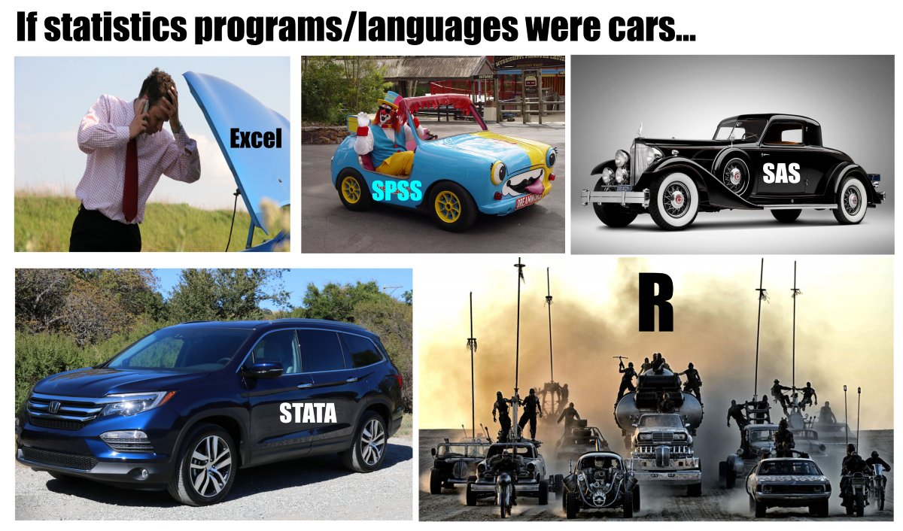
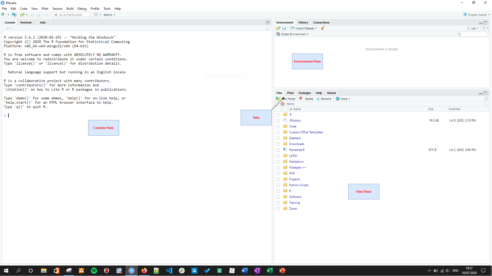
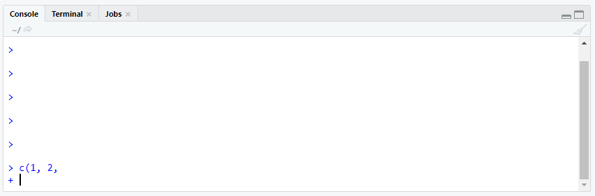
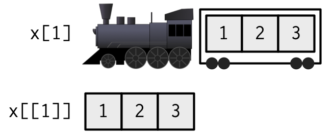
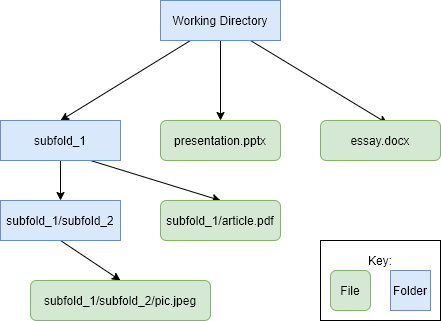
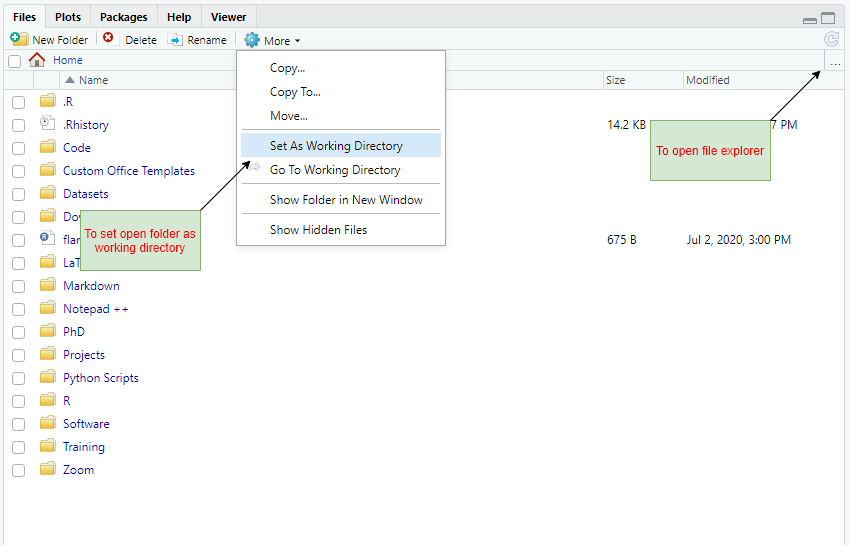

```{r setup, include=FALSE}
knitr::opts_chunk$set(echo = TRUE)
```

In this document, I am going to provide a brief introduction to the R programming language. By the end, you should have a basic understanding of R. I also provide links to further resources, which will allow you to dive into R in greater depth. R has a steeper learning curve than other languages, such as Stata, but it is much, much more powerful. Do not get discouraged if you find it difficult - everyone does to being with. The effort pays off handsomely in the end.



# Getting Started

To use R, we will be using two pieces of software: **R** and **RStudio**. R is the programming language for performing statistical tasks. RStudio is a Graphical User Interface (GUI) for R - it makes using R much easier. Your UCL Desktop should have R and RStudio installed, but if you want to use your own computer, install R from [**here**](https://cloud.r-project.org/) and RStudio from [**here**](https://rstudio.com/products/rstudio/download/). Both are free and open-source. I’ll discuss what open-source means later. 

Once you have both R and RStudio installed, open RStudio by searching for it in the start menu. RStudio will automatically connect with an instance of R in the background. When you first open RStudio, you should see three panes (see Figure 2): the console pane, the file pane, and the environment pane. Each of these panes contains several tabs - for instance, the environment pane has tabs for environment, history and connections.



The `Console` tab (left-side of the window) is where we will type commands. The output of these commands will also be printed to the console. When you open RStudio, the console should already display some information about the version of R installed. You can see in Figure 2 that I have version 3.6.3 installed. You may have an earlier version or a later version, but everything should still work fine.

The `Files` tab (lower right) displays information about the folders and files on your computer. The other tabs on this pane are used for: viewing help files (`Help`); displaying plots (`Plots`); displaying formatted tables (`Viewer`); and viewing installed packages (`Packages` - more on this later).

The `Environment` tab (upper right) displays information on data we currently have in memory. We haven’t loaded any data into R or produced any other data yet, so the tab is currently empty, but we’ll see this change later on. The `History` tab will record the list of commands we have inputted into the console. We'll ignore the `Connections` tab now as it is rarely used.

There is a fourth pane - the Script pane - which currently isn’t open. Scripts are used in R to save code so that analyses can be reproduced later. Let’s open a new script now. Click `File -> New File -> R Script` or, alternatively, press `Ctrl+Shift+N`. Once you do this a blank file should appear in the top left of the window. If you want to, you can resize the panes by dragging their borders and you can change the position of panes by clicking `Tools -> Global Options... -> Pane Layout`.

Make sure to save your script frequently so you keep a record of your code. You can save the script by clicking the floppy disk button at the top of the script. Give the file a comprehensible name, such as `Introduction to R`.

# Basics of the R language

Let’s start writing some commands into the R console. Below is code that I would like you to type into the console. The code is shown in grey boxes in `monospace` font.

First, we’ll start with some basic arithmetic. Next to the "`>`" symbol in the console, type the following commands line by line. Hit `enter` at the end of each line to run the command.

```{r, results = 'hide'}
3 + 5
7 - 6
3*7 # Multiplication
5/4 # Divide
2^3 # Exponentiate
(3+4)/2 # To change precedence to addition over division
```

I've added comments to the ends of some lines using the `#` character. These comments are not necessary for the code to run: R knows the `#` character starts a comment so will ignore whatever comes after it on a given line. Comments are useful for reminding yourself why you did what you did and what you were trying to do. They also help when sharing your work with others. I recommend getting into the habit of adding comments to your code. It will make your life much easier later on.

By now, you should have entered a few commands into the R console. I want you to play around a bit by changing some of the commands above. Try combining multiple mathematical operations. Can you explain why the three commands below produce different results?

```{r}
3 + 5/2 * 8
3 + 5 /(2 * 8)
(3 + 5)/2 * 8
```

Why do the next two lines produce the same result?

```{r}
(3 + 5)/2 * 8
(3 + 5) * 8/2
```


The answer is that some mathemetical operations have precedence over others. Operations in parentheses are carried out first. Multiplication and division have precedence over addition and subtraction, but have the same precedence as each other. In the event of a tie, operations are carried out from left to right.

We should now move on to writing our code into the script. You can type commands directly into the script as above, but to run the code, you need to send the commands to the console. You can do this by clicking on the line you want to run and pressing `Ctrl+Enter` (`Cmd+Enter` on Mac). Watch what happens in the console window when you do this. If you want to send many lines at once, you can highlight multiple lines and then press `Ctrl+Enter`. You should use scripts wherever possible so analyses are self-contained and you can refer back and reproduce what you did.

# Assignment
We’ll often want to store the result produced by a command. We can do this using the assignment operator, "`<-`". Below, we'll create an R “object” called `x` which is equal to the value of 2 multiplied by 3 (i.e. 6). Look what happens in the environment pane when you enter the command.

```{r}
x <- 2*3
```

You should now see an object `x` with value 6. R has computed 2 multiplied 3, returned 6, then saved that value to an object called `x`. We can use `x` in other commands, including computations involving other objects. Run the commands below. 

```{r, results = 'hide'}
x^3
y <- 2 + x
z <- x/y
z
```

Can you explain what is going on? Can you guess what the next line will do?

```{r}
y <- x*y
```

Notice that we were able to use the current value of `y` to update its value. Notice, also, that the value of `z` did not change when we changed the value of `y`. `z` is not linked to the current value of `x` and `y`. Rather, it is just equal to what the value of `x` divided by `y` was when `z` was created. 

The nice thing about R is that if you aren’t sure how something is working, you can experiment to check your understanding. So if you aren’t clear about the above, try inputting some other commands and see whether the results align with your expectations.

# Functions
We’ve only done some very basic operations so far. More complex operations are carried out using *functions*. Below are some very common functions you will come across a lot. Run these and check the output.

```{r, results = 'hide'}
c(1, 2, 3) # Creates a vector of values
mean(x = c(x, y, z)) # Computes mean of a vector
str(x) # Displays the structure of an object
paste("The current value of x is", x) # Pastes objects together into a single string
rm(y) # Deletes an object from memory
```

Note, a vector is just a set of values. Vectors are central to the R language. I will discuss them again further below.

The basic syntax of R functions is `function_name(argument_name_1 = input_1, ..., argument_name_n = input_n)`. It is not necessary to type argument names when using a function. For instance, we used the argument name `x` when running the `mean()` function, but we did not use argument names when using `str()` or `rm()`. 

In fact, some functions, such as `c()` and `paste()` above, do not have names for all arguments because they take an indeterminate number of inputs (i.e. you can use `c()` to create vectors of any length). If you don't supply argument names, R will interpret arguments *positionally* - that is, the first input will be paired with the first function argument, and so on. To see the arguments of a specific function, view its help file. You can do this by either searching for the function in the `Help` tab (bottom right of the window) or typing `?` followed by the function name into the console (e.g. `?str`).

If you do use argument names when using a function, you can change the order you put inputs into the function. Note, functions can also be nested inside other functions. For example, when running `mean(x = c(x, y, z))` above, we passed a vector created by the `c` function to the `mean` function. We are also able to pass objects we have stored in memory into functions (which we do in lines 3-5 above).

A common problem when inputting functions is to not have included a matching closing parenthesis, "`)`", for an opening parenthesis, "`(`". When this occurs, R will expect more code to be inputted before it runs the command. (This feature allows you to write commands that run over multiple lines, to aid readability). You will be able to see if this has happened if there is a "`+`" sign at the bottom of the console (see Figure 4). Press `escape` on your keyboard to break out of this, if this happens.



# Packages

R comes packaged with only a limited set of functions. This set of functions is typically referred to as *Base R*. These do not cover many of the tasks we would like to do using R, so to increase functionality, we need to install ***packages***. Packages are collections of functions and other objects, such as data, typically designed around a small set of tasks, some rather niche. For instance, the `twitteR` package allows you to download and send tweets directly from R. 

Packages are produced by the community of R users and are freely available to install. As mentioned, R is open source. This means that R is free in two senses: *free* as in free beer, and *free* as in free speech. Anyone can contribute to improving R and anyone can take the underlying code and amend it at will to suit their purposes. Further, anyone with access to a computer and some data can do their own research or replicate existing scientific work, regardless of income or affiliation to a paying institution. This makes R far more egalitarian and democratic than other propriety software, such as Stata, the versions of which run in hundreds or thousands of pounds *per year*!

Open-source has two other advantages. First, as it is built on the voluntary contributions of many people, there is a very enthusiastic community you can go to for help. (I provide some links to free resources at the end of this document.) Second, development is not dependent on a single slow-moving organisation. This means you can find R packages for a huge array of tasks. For instance, you can use the [`flametree` package](https://flametree.djnavarro.net/) to make art in R (Figure 5).


This is what makes R wonderful, but it also has drawbacks. As individuals come up with their own solutions independently, many common functions do not work particularly well together. Working out how to get the result of one function into another can be time consuming and contributes to the steeper learning curve that R has compared with some other languages. Thankfully, there are many forums online (notably `StackOverflow`) where you can look for help on your problems. *One of the most useful R skills is learning how to Google effectively.*

Back to packages. To use a package, we need to install it and then load it into R. We only need to install a package once, but we need to load the package each session to use it. Let's install the `tidyverse` package and load it. We'll be using this package a lot throughout the course. Below I introduce the `tidyverse` in further detail. It may take a while to install as it is quite a big package.

```{r, eval = FALSE}
install.packages("tidyverse")
library(tidyverse)
```
```{r, include = FALSE, message = FALSE, warning = FALSE}
library(tidyverse)
```

# Data Structures and Data Types

Before discussing the `tidyverse`, I want to introduce three more components of the R language: data structures and data types, vectorisation, and subsetting.

## Vectors

The simplest structure for storing data in R is the `vector`. We created a numeric vector above using the command `c(1, 2, 3)`. Vectors can only store one type of data at once. There are several data types in R: numeric, integer, character, logical and complex.

* Double
  * Numbers with ability to store decimal places (e.g. 1, 2.49, etc.)
* Integer
  * A round number. Denoted using `L` operator (e.g. 1L for integer 1).
* Character
  * Strings, such as "Hello" and "My name is Liam".
  * Strings are surrounded by single (`'`) or double (`"`) quote marks.
* Logical
  * *Boolean* values `TRUE` or `FALSE`
* Complex
  * Have limited use, and we will not come across them in this course.

To view the type of a vector, use the `typeof()` function.

```{r}
typeof(c(1, 2, 3))
typeof(c(1L, 2L, 3L))
typeof(c("Hello", 'My name is Liam'))
```

Another data type we will come across is the `factor`. Factors are used to store categorical data (gender, ethnicity, etc.). They only allow a defined set of categories. These categories are set in the `levels` argument of the `factor()` function. Below, we create a new factor, `age_factor`, using a character vector which contains a value that is not included in the `levels` argument. Look what happens when we display the contents of the factor.

```{r}
age_vec <- c("18-30", "30-60", "60+", "My name is Liam")
age_factor <- factor(x = age_vec, levels = c("18-30", "30-60", "60+"))
age_factor
```

The last value is  `NA`. `NA` is R's missing value. Because `"My name is Liam"` was not in the allowed levels, it was changed to missing when we created the factor.

If you use the `typeof()` function on a factor, it will return "`integer`". Underlying a factor is really just an integer vector. However, factors have two `attributes` (bits of metadata) that allow them to be interpreted in as factor*: the `class` atrribute and the `levels` attribute. You can see the attributes of an object using the `attributes()` function. To see the `class` and `levels` attributes directly, you can also use the `class()` and `levels()` functions.

```{r}
typeof(age_factor)
attributes(age_factor)
class(age_factor)
levels(age_factor)
```

Compare the output of the next two lines of code. Even though underlying the factor is the same integer values (you can verify this by using the `str()` function or looking at `Environment` tab), the `summary()` function produces different results.

```{r}
summary(age_factor)
summary(c(1L, 2L, 3L, NA)) # An integer vector
```

`summary()` is able to produce different results because `summary()` is a ***generic function***. How generic functions work depends on the type and attributes of the inputs you give them. 

If you want to create a factor that has levels with a natural ordering (e.g. age group), you can create an "ordered" factor to preserve this ordering. Ordered factors make a number of calculations easier to carry out, which we'll make use of in future sessions.

```{r}
age_factor_ord <- ordered(x = age_vec, levels = c("18-30", "30-60", "60+"))
str(age_factor_ord)
```

## Lists

Vectors can only hold one type of data at once: a vector cannot hold both character strings and numerics, for example. If you try to use two types of data in a single vector, one type will be *coerced* into another. See what happens when you run the following commands.

```{r, eval = FALSE}
c(1, FALSE, TRUE)
c(2949, "Hello")
```

To store different types of data in a single object, use **lists**. Lists are objects that are made up of other objects, such as vectors or other lists. To create a list, use the `list()` function.

```{r}
x <- list(c(1, 2, 3), "Hello", c(TRUE, FALSE))
x
```

`x` is a list with three elements (or sub-objects): the numeric vector `c(1,2,3)`, a character vector of length 1 (`"Hello"`), and a logical vector `c(TRUE, FALSE)`. We can name the elements of a list using the function arguments:

```{r}
x <- list(num = c(1, 2, 3), greeting = "Hello", bool = c(TRUE, FALSE))
x
```

Now the three elements of `x` are named `num`, `greeting` and `bool`. You can use the `names()` function to view the names of the elements in a list. This function can also be used to set the names of an existing object.

```{r}
names(x)
names(x) <- c("numbers", "welcome", "booleans")
x
```

Vectors can also be given names in a similar fashion.

```{r}
ages <- c(Peter = 28, Mary = 22, John = 29)
ages
names(ages) <- c("David", "Fiona", "Philip") # Setting new names
ages
```

A special type of list is the `data.frame`. A `data.frame` is a list made up of objects (vectors and/or lists), which all have the same length. A `data.frame` is like a rectangular spreadsheet: every object within the `data.frame` is a column, and every element within an object is a cell. (The same position across objects makes up a row.) `data.frames` are like `factors` in that they are built upon another data type and contain metadata (`attributes`) to distinguish them for use in generic functions. `data.frames` have the `class` attribute `"data.frame"`.

The main dataset we will use in this module will be stored as a `data.frame`. For now, let's look at the `iris data.frame` that comes bundled with R. `iris` is a dataset of measurements from 150 flowers. Run the following lines to look at `iris` object

```{r}
str(iris)
View(iris)
```

We can see that `iris` contains 5 variables (columns) and 150 observations (rows). Four variables are numeric. One - `Species` - is a factor. We'll return to the `iris` object later.

## Matrices and Arrays

Two other important data structures are matrices and arrays. Matrices and arrays are to vectors what `data.frames` are to lists. They build upon vectors, but have a `dim` attribute which defines the dimensions of the object. Matrices are two-dimensional (rows and columns), while arrays can have a higher number of dimensions. Like vectors, matrices and arrays can contain only one data type.

To create a matrix, use the `matrix()` function. The dimensions are set in the `nrow` or `ncol` arguments.

```{r}
x <- matrix(1:8, nrow = 2) # ncol not required if nrow is used, and vice versa
x
```

The names of a matrix can be viewed or overwritten using the `dimnames()` function. The `dimnames` are a list with vectors for the names of each dimension.

```{r}
dimnames(x) <- list(c("row_1", "row_2"), c("a", "b", "c", "d"))
x
```


# Vectorisation

Vectors are central to the R language because R is a ***vectorised language*.** Many R functions expect vectors as inputs and return vectors as outputs. For instance, when multiplying two vectors, R multiplies elements at the same position, returning another vector as the output.  

```{r}
x <- c(3, 6, 9, 12)
y <- c(2, 7, 28, 29)
x*y
```

In this instance, the two vectors `x` and `y` were the same length. Where vectors are different lengths, most R functions will ***recycle*** the shorter vector to the same length of the longer vector. For instance:

```{r}
x <- c(1, 3)
y <- c(1, 2, 3, 4)
x*y

z <- c(5, 6, 7)
x*z
```

Notice the warning message when multiplying `x` by `z`. R is noting that the shorter vector (in this case `x`) cannot be fully recycled to the length of the longer vector (in this case `z`) - i.e. 3 is not a multiple of 2. The command still ran, but the message is there to warn of potential mistakes.

# Subsetting

We often want to use only a small part of an object - for instance a single element of a vector or a set of rows and columns from a data frame. To do this, we use ***subsetting***. There are several ways of subsetting objects, which I outline below. 

## Subsetting vectors by position indices

You subset vectors by passing information into square brackets, `[]`, which are typed after the vector's name. There are multiple types of information you can pass, each giving different results. We'll start by subsetting by position.

We can pass a single index or multiple indices to return the elements in those positions. The leftmost position is position 1.

```{r}
weights <- c(Peter = 78, Mary = 64, John = 92)
weights[2] # Subset by position - returns 2
weights[c(3, 3, 1)] # Subset by position - returns 3, 3, 1
```

If the position does not exist, R will return `NA`.

```{r}
weights[4]
```

Passing a negative number will return the vector minus those positions.

```{r}
weights[-1]
weights[-c(2, 3)]
```

A helpful function for subsetting is the `x:y` function. This function creates a vector of integers from `x` to `y`. For instance:

```{r}
400:404
weights[1:2]
weights[3:1]
```

## Subsetting vectors by name

Vectors can also be subset by name. Using a name that doesn't exist will return `NA`.

```{r}
weights["Mary"]
weights[c("John", "Mary")]
weights["Gary"]
```

Subsetting can be be used directly on the result of a function. When used with a numeric vector, `summary()` returns a named vector containing descriptive statistics.

```{r}
summary(weights)
```

We can extract just the median using:

```{r}
summary(weights)["Median"]
```

(Other forms of subsetting also work!)

## Subsetting vectors using logical vectors

Finally, vectors can be subset using logical vectors (i.e. vectors of `TRUE` and `FALSE`). R returns the positions where the logical vector is `TRUE`.

```{r}
weights[c(FALSE, TRUE, TRUE)]
```

Here, we get the results for Mary and John but not Peter because `FALSE` was given for the first position.

But, to use logical vectors, we need a simple way of constructing them. We can do this using *Boolean expressions*. The main Boolean expressions are:

```{r, eval = FALSE}
weights == 64 # Equals to
weights != 64 # Not equals to
weights %in% c(78, 64) # Present in vector
weights < 78 # Less than
weights <= 78 # Less than or equal to
weights > 92 # Greater than
weights >= 92 # Greater than or equal to
```

The `!` NOT operator can also be used around expressions to ***negate*** them (`TRUE` becomes `FALSE`, `FALSE` becomes `TRUE`). Compare:

```{r}
weights > 78
!(weights > 78)
```

We add these Boolean expression into the `[]` brackets to subset vectors.

```{r}
weights[weights <= 78]
```

Note, the Boolean expression does not have to be about the vector itself.

```{r}
weights[1:3 > 2]
```

Boolean expressions can be chained together using the `&` (`AND`) and `|` (`OR`) operators. For instance:

```{r}
weights[weights < 70 | weights > 80]
weights[weights < 70 & weights > 80]
```

The second statement above returns a vector of length 0 because none of the Boolean expression elements were `TRUE` (it is impossible to be younger than 70 **and** older than 80).

You may need brackets to ensure the full Boolean statement works as expected. Notice the difference between the two results below.

```{r}
weights[weights > 80 | weights == 64 & weights < 70 ]
weights[(weights > 80 | weights == 64) & weights < 70 ]
```

## Subsetting Lists

You can also use the square bracket syntax (`[]`) to subset lists. When you use the square brackets to subset lists, R returns another list containing just those elements.

```{r}
info <- list(ages = c(15, 29, 38), status = c("Employed", "Student", "Unemployed"))
info["ages"]
info[2]
info[c(TRUE, FALSE)]
```

To extract a sub-object from a list, use the `[[]]` or `$` operators. These only return one sub-object at once. The double square brackets (`[[]]`) can be used with position indices or names. The dollar-sign operator, `$`, can only be used with names.

```{r}
info[[2]]
info[["ages"]]
info$status
```

Figure 6 makes clearer the distinction between the single square brackets and the double square brackets. Imagining a list as a train with sub-objects as carriages, subsetting with the single square brackets returns another train with the specified carriages attached. The double square brackets and dollar sign operators return just the contents of the specifed carriage (i.e. the sub-object itself). The image and analogy are taken from Hadley Wickham's Advanced R book [(**link**)](https://adv-r.hadley.nz/subsetting.html).



Subset operations can be chained together. For instance, to extract the third item from the second element of the list `info`, we use:

```{r}
info[[2]][3]
```

## Subsetting `data.frames`
`data.frames` have an additional way they can be subsetted: `[rows, columns]` syntax. Positional indices, names, and boolean statements can all be used with this syntax. The following statements all return smaller data frames.

```{r, eval = FALSE}
iris[3:4, 2:1] # Returns rows 3 and 4 of columns 2 and 1.
iris[c(1, 3), c("Species", "Sepal.Width")]
iris[iris$Sepal.Width==3.5, c(1, 5)] # Returns rows of columns 1 and 5 where Sepal.Width equal 3.5
```

If you use `[rows, columns]` and subset a single column, the column will be extracted, rather than a smaller `data.frame` returned.

```{r}
iris[3:4, "Species"]
```

If you do not specify any rows or columns, all the rows or columns will be returned. For instance:

```{r, eval = FALSE}
iris[, 1:2] # Returns all rows from columns 1 and 2
iris[c(3, 4, 5), ] # Returns rows 3, 4, and 5 from all columns
iris[ , ] # Returns the original data frame
```

The `[rows, columns]` notation is also used to subset matrices and two dimensional arrays. `[rows, columns, ..., dim_n]` is used for higher-dimensional arrays.

# ELSA and the Working Directory

In this module, we will be working with an extract from the first wave of the English Longitudinal Study of Ageing (ELSA). ELSA is a panel study of older adults in England, which started in 2002. It tracks the health and wellbeing of a sample of 15,000 over-50s, and has been used in thousands of academic and government studies. You can read more about ELSA [**here**](https://www.elsa-project.ac.uk/). 

Let's have a brief look at this dataset. You can download the dataset from the module Moodle page. 

To load the dataset into R, we'll need to provide the `load()` function with the file path of the file. First, let's set our *working directory* to the folder which contains the dataset. The working directory is the folder from which R will look to load and save files. When you pass R a file path, it will look for the file relative to the working directory. The idea is explained graphically in Figure 7 below.



So, to load `pic.jpeg` which is in a subfolder of a subfolder of the working directory, we would use the command `load("subfold_1/subfold_2/pic.jpeg")`. To load `essay.docx`, we would just use `load("essay.docx")`. The "`/`" character delineates folders. Note, R uses the "`/`" character in file paths, rather than the "`\`" character used by Windows.

Set the folder containing the ELSA dataset as your working directory. You can use the `Files` tab (bottom right of screen) to navigate to the folder containing the dataset - if you click the three dots, `...`, at the right of that tab, it will open the file explorer so you can choose the correct folder (Figure 8). When you have selected the correct folder, it should appear in the `Files` tab.  Next, click the `More` button and select `Set as Working Directory` (Figure 8). This sends the `setwd()` command to the console. Copy and paste this command into your script, so your script is self-contained and includes everything needed to complete this tutorial afresh. (To change working directory, you can use the `setwd()` function directly.) 



Now we can load the dataset.

```{r}
load("elsa.Rdata")
```

The dataset should now be loaded as an object called `elsa`. Use the `str()` function to briefly look at the dataset.

```{r, eval = FALSE}
str(elsa)
```

I haven't included the output here, but you should see that the `str()` function tells us that `elsa` is a `tibble`. A `tibble` is a special type of `data.frame` that enforces particular rules. Importantly, when you subset a single column using the `[rows, columns]` syntax, another `tibble` is returned. Tibbles also do not allow recycling of vectors, unless the shorter vector is of length 1. 

You'll also see in the output that the columns each have an attribute, `label`. This attribute tell us what the column measures. A useful function for exploring a labelled data.frame is the `look_for()` function from the `labelled` package. `look_for()` prints variables and their labels. You should use this function throughout the course to find relevant variable for the tasks.

```{r, eval = FALSE}
install.packages("labelled")
library(labelled)
look_for(elsa)
```

We'll continue exploring this dataset using some functions from the `tidyverse()`.

# The Tidyverse

The `tidyverse` is a package of packages which contains many popular functions for doing data analysis in R. The functions are built around a common design philosophy and are easier to use than many Base R functions. In this section, I'll introduce some of the main functions from the `tidyverse`. If you want to learn more, there are links to further resources in the final section.

## The Pipe (`%>%`)

The `tidyverse` functions I will introduce are `select()`, `rename()`, `filter()`, `mutate()`, `summarise()`, `group_by()`, and `arrange()`. These come from the `dplyr` package within the `tidyverse`. Before introducing these, though, I want to introduce you to the "pipe" operator, `%>%`, which comes from the `magrittr` package in the `tidyverse`.

The pipe works as follows: it takes the object from its left hand side and puts it into the first argument of the function on its right hand side. This is best explained by example:

```{r}
c(1, 2, 3) %>% mean()
```

So, in this command, R first created the vector, `c(1, 2, 3)`, then put this into the `mean()` function. 

Pipes can be chained together. For instance:

```{r}
c(1, 2, 3) %>% mean() %>% paste("is the mean value")
```

You can read a series of pipe operations as "do this, then do this, then do this...". You can see this is much easier to read than:

```r
paste(mean(c(1,2,3)), "is the mean value")
```

RStudio has a number of clever features. One feature is that it expects code after a pipe. RStudio will run lines of code until it finds the end of a command. So, to aid readability, you can write the above function across multiple lines in your script and RStudio will know to send all the lines to the console when you hit `Ctrl+Enter`.

```{r}
c(1, 2, 3) %>% 
  mean() %>%
  paste("is the mean value")
```

Sometimes you might want the object on the left hand side of the pipe to go into an argument other than the first one for the function on the right hand side. In this case, use the "`.`" syntax to refer to the object. Below, the lefthand object is placed into the second argument of `paste()`.

```{r}
c(1, 2, 3) %>% 
  mean() %>%
  paste("The mean value is", .)
```

## `select()` and `rename()`

Now we can start learning a few more functions from the `tidyverse`. `select()` keeps certain columns from a `data.frame`. The code below keeps the columns `sex`, `age`, and `bmi` from `elsa` and discards the rest. (Note, because we haven't assigned the result, we haven't overwritten the original dataset.)

```{r, eval = FALSE}
elsa %>%
  select(sex, age, bmi)
```

We can also use the minus symbol to state which columns we don't want to keep, rather than the ones we do.

```{r, eval = FALSE}
elsa %>%
  select(-id, -sex)
```

`select()` can also be used with the `everything()` helper function to rearrange the order of columns. Below we move `heart_attack` to the first column position (`everything()` returns all columns in a `data.frame`).

```{r, eval = FALSE}
elsa %>%
  select(heart_attack, everything())
```

We can also use named arguments in the select function to rename columns as we select them.

```{r, eval = FALSE}
elsa %>%
  select(region = gor)
```

If you want to just rename a column without dropping other columns, use the `rename()` function.

```{r, eval = FALSE}
elsa %>%
  rename(region = gor)
```

## `filter()`

What `select()` is to columns, `filter()` is to rows. Pass Boolean expressions to the `filter()` function to return the rows for which the statements are true.

```{r, eval = FALSE}
elsa %>%
  filter(bmi > 30)
```

Multiple statements can be passed to the function by using multiple arguments. These are evaluated sequentially, so are equivalent to writing `statement_1 & statement_2 & ...`.

```{r, eval = FALSE}
elsa %>%
  filter(age == 60,
         sex == "female")
```

Above, we are able to write the `filter()` function across several lines as RStudio looks for a matching brace.

If you want to combine multiple statements with an `OR`, you'll need to combine them using the "`|`" operator. Below we get individuals who either age 60 or female.

```{r, eval = FALSE}
elsa %>%
  filter(age == 60 | sex == "female")
```

## `mutate()`

The `mutate()` function is used to create new columns/variables in the `data.frame`. The new variable can be a function of other variables. Below we create two new columns for age-squared and BMI multipled by age-squared. Note, when creating the latter variable, we use the first variable created in the same function call. We are able to do this because, like `filter()`, `mutate()` works sequentially.

```{r, eval = FALSE}
elsa %>%
  mutate(age_sq = age^2,
         bmixage_sq = bmi*age_sq)
```

A helpful function to use within the `mutate()` function is `ifelse()`. The value `ifelse()` returns depends on whether a Boolean expression is `TRUE` or `FALSE` for a given observation. Below we create a new variable `high_bmi` which is equal to `"Above median BMI"` if the individual's BMI is above the median BMI in the whole `data.frame`, and `"Below median BMI"` otherwise.

```{r, eval = FALSE}
elsa %>%
  mutate(high_bmi = ifelse(bmi > median(bmi), 
                           "Above median BMI",
                           "Below median BMI"))
```


## `summarise()`

As the name suggests, `summarise()` is used to summarise data within a `data.frame`. It returns a single value and discards the other data in the `data.frame`. Below we use `summarise()` to find the mean BMI in the dataset. (We use the argument `na.rm = TRUE` to ignore missing values.)

```{r}
elsa %>%
  summarise(mean_bmi = mean(bmi, na.rm = TRUE))
```

Multiple variables can be produced in the same `summarise()` function call.

```{r}
elsa %>%
  summarise(mean_bmi = mean(bmi, na.rm = TRUE),
            min_bmi = min(age, na.rm = TRUE),
            max_sbp = max(sbp, na.rm = TRUE))
```

## `group_by()`

`group_by()` is used to split a `data.frame` into groups, so that calculations are carried out respecting the groups. `group_by()` is easier to explain by example. Below I group `elsa` by `sex` to get median cholesterol (`chol`) and mean BMI figures for each continent separately. The results is a single `data.frame` with one row for each sex

```{r}
elsa %>%
  group_by(sex) %>%
  summarise(mean_bmi = mean(bmi, na.rm = TRUE),
            median_chol = median(chol, na.rm = TRUE))
```

## `arrange()`

The last function I'll show is `arrange()`, which is used to sort rows. Let's rearrange by `age`, `sex`, and `bmi`.

```{r, eval = FALSE}
elsa %>%
  arrange(age, sex, bmi)
```

By default, observations are sorted into ascending order. To use descending order instead, use the `desc()` function. The following sorts the `data.frame` in order of decreasing age.

```{r, eval = FALSE}
elsa %>%
  arrange(desc(age))
```

We can use `arrange()` with the `slice()` function to extract specific rows. (`slice()` is like `filter()` but you give it positional indices rather than Boolean expressions.) Below we extract the five rows with highest BMI.

```{r, eval = FALSE}
elsa %>%
  arrange(desc(bmi)) %>%
  slice(1:5)
```

This only touches upon what can be done with the `tidyverse`. Links to further information on the `tidyverse` is shown in the Further Resources section.

# Further Resources

There is a huge amount of free resources for learning R, including courses, books, and videos. YouTube is a great place to start, as is [***swirl***](https://swirlstats.com/), which teaches you R directly within RStudio. [***Hands-On Programming with R***](https://rstudio-education.github.io/hopr/) by Garrett Grolemund is a nice introduction to R from a programming perspective. To learn more about the `tidyverse`, read Hadley Wickham and Garrett Grolemund's book [***R for Data Science***](https://r4ds.had.co.nz/). The [***tidyverse***](https://www.tidyverse.org/packages/) website is also good and includes many "vignettes" to show you how to use specific functions. RStudio also produce quick-reference [***cheatsheets***](https://rstudio.com/resources/cheatsheets/) for many popular packages.

There is an active Twitter community centered around the [***#rstats***](https://twitter.com/hashtag/rstats?lang=en) hashtag. The *R for Data Science Online Learning Community* (R4DS) run a weekly Twitter [***TidyTuesday***](https://twitter.com/r4dscommunity?lang=en) event where they post a dataset which people then work on. Some of the results are extraordinary and, helpfully, people post their code. Even if you don't participate, it's a good opportunity to see what is possible and to learn from others.

If you have a specific question, chances are it has already been answered on the forum [***StackOverflow***](https://stackoverflow.com/). StackOverflow is usually the first website to appear when you search for R help on Google. Try to check your question hasn't already been answered before posting a new question on the website. Another place you post questions is the [***R4DS Slack Channel***](https://www.rfordatasci.com/).

While there is lots of help online, the only way you'll cement your knowledge is to practice and to experiment to check your understanding. Don't be afraid to break things - all you need to remember is not to overwrite original data. Don't be discouraged if (no, when) you find it hard to begin with. This is everyone's experience. It will gradually start to make more sense.